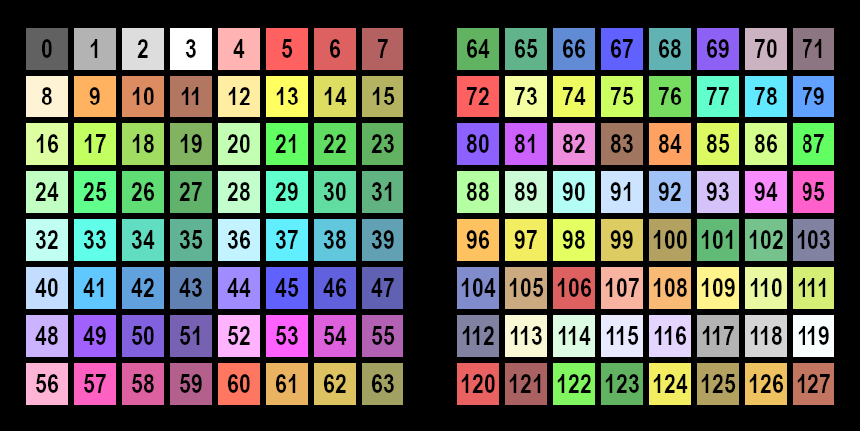

{align=right width=50%}
For some functions, suck as the [soundboard configuration](./functions/soundboard.md), it is possible to customize the color of a button. Each color is represented by a number, as shown in the image. To set a color, you can either fill in the number, or press the color picker button (represented by a palette icon).

By pressing the color picker button, all the available colors will be displayed on the Launchpad. 
There are 2 groups of 64 colors, and by pressing the one of the function keys (rightmost keys), you can switch between the groups. The currently selected color will be fading, and pressing a key will send the color of that key to the Soundboard Configuration screen. 
An empty color field will be interpreted as a 0, which means that the LED will be off.