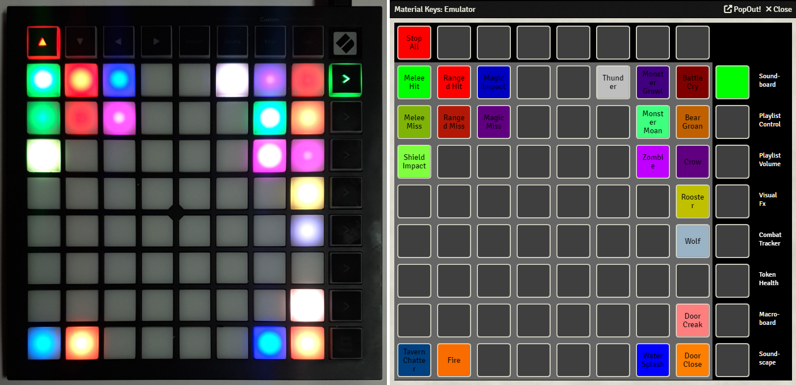

Material Keys has a built-in Launchpad emulator. This emulator allows Material Keys to be used without a physical Launchpad. 

It has the same buttons as a Launchpad Mini or Launchpad X and it mirrors what is displayed on your physical Launchpad (if there is any connected), as shown in the image below. The buttons can be pressed as if it were a real Launchpad. 

The emulator show some extra information that a physical Launchpad cannot, such as sound/macro/playlist/token names. It can be useful as a quick reference, in case you have forgotten what sounds/playlists/macros you have assigned to the launchpad.

You can access the emulator in the sidebar, in the 'Game Settings' tab.

