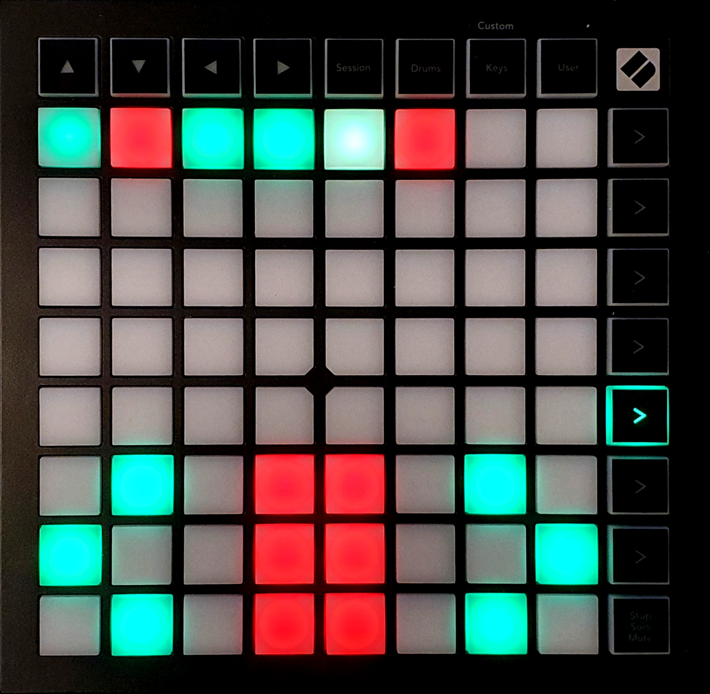

{align=right width=50%}
The combat tracker screen gives a rough indication of the initiative order, and it can be used to start or stop the combat and go to the next or previous turn. 
You can enter the combat tracker screen by pressing the fifth function key from the top.

The combat tracker can be divided into 2 parts:

### Initiative Tracker
The top part gives the initative tracker. If there are tokens in Foundry's combat tracker, these will be displayed on the top rows. The color can be green, yellow or red, indicating a friendly, neutral or hostile token, respectively. Alternatively it can be white, which means that the token has been defeated. Pressing one of these buttons will pan the screen to that token, and select the token. 

Once combat has started, a fading LED will indicate whose turn it is. 

If more than 8 tokens are in the combat tracker, they will fill up the rows below. A total of 32 tokens can be displayed.

### Controls
The bottom part gives 3 control buttons: start/stop combat, previous turn, next turn. 
If no tokens are in Foundry's combat tracker, all buttons will fade, indicating that they are inactive. 
One one or more tokens are in the combat tracker, the start/stop button will stop fading, indicating that it can be pressed to start the combat. 
Once combat has started, all buttons stop fading, and the color of the buttons change. The start/stop button now turns red to indicate that it is now the stop combat button, and the next/previous buttons turn green.