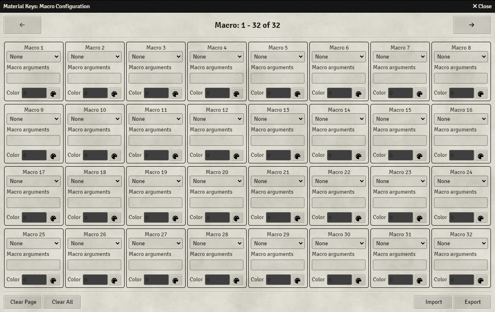

The macroboard allows you to trigger macro's. You can use chat or script macro's with macro arguments. 
You can enter the Macroboard by pressing the 7th function button from the top. 
Once you've set up the macroboard, pressing a key will trigger the pre-set macro.

### Macroboard Configuration
{align=right width=50%}
The macroboard is set-up in the Macro Configuration screen, which can be found in the module settings. 
The screen is divided into boxes, each labeled 'Macro #', where each represents a single sound and its settings. This screen will be refered to as a page.
By pressing the arrows at the top right and top left, you can go to the next or previous page. Macro 1 is the top left main key, Macro 2 is the one to the right of that, etc. 
You can set up a total of 256 macros. Since there are only 64 keys on the Launchpad, you have to access the next 64 macros by pressing the 7th Function key from the top.

For each sound there are multiple options:

* <b>Macro:</b> Using the drop-down menu you can select the desired macro
* <b>Macro Arguments:</b> Here you can enter macro arguments, see below.
* <b>Color:</b> This sets the color of the corresponding macro key. See the [here](../colorPicker.md) for information on what the color number represents

At the bottom you have the following buttons:

* <b>Clear Page</b> - Clears all the macros on the current page. This is irreversible.
* <b>Clear All</b> - Clears all the macros. This is irreversible.
* <b>Import</b> - Import the macroboard from a file. This will override your current macroboard, and is irreversible.
* <b>Export</b> - Export your macroboard to a file.

When importing and exporting, you only import/export the metadata, not the actual macros. This means that you need to have the same macros in the same relative location in both the source and target Foundry client,
or you might run into issues.

### Macro Arguments
You enter objects as macro arguments, which can be retrieved in the macro from the scope object, for example, `scope.x`.

Take the following macro to move the selected token to coordinates x and y: 
`token.document.update({x: scope.x, y: scope.y})` 
If you want to call this macro from Material Keys to move the token to x=1000 and y=1500, you'd use the following arguments: 
`{"x":1000, "y":1500}` 
Please note that you must include the quotation marks around the object keys.