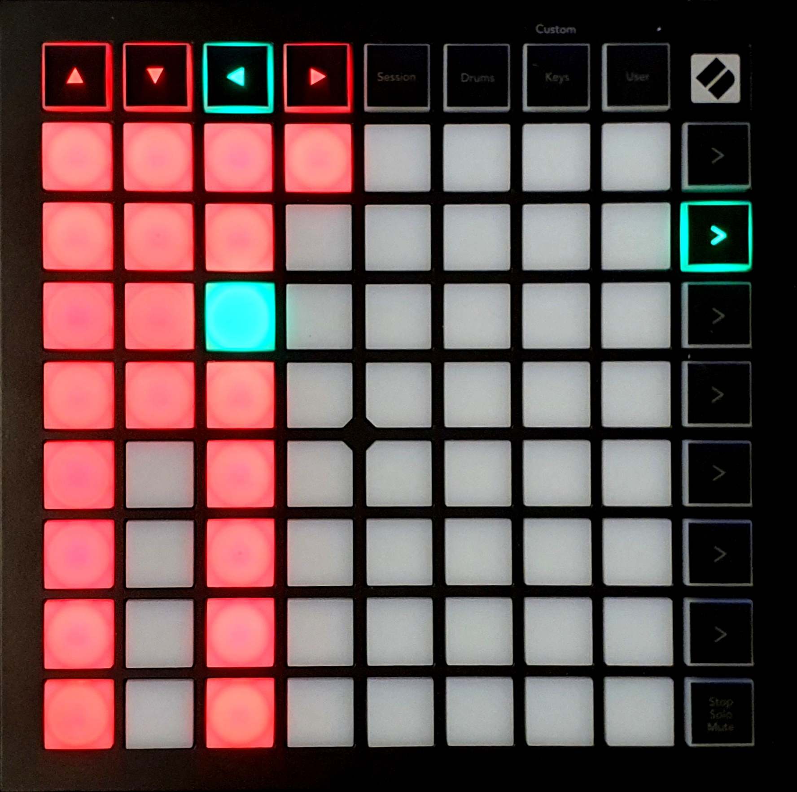
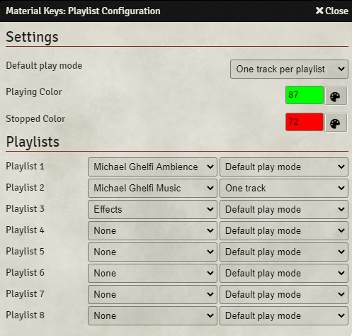

### Playlist Control
{align=right width=50%}
The playlist control screen gives easy control over up to 8 playlists. For each of these playlists, up to 32 tracks can be directly controlled. For each of these tracks and playlists, you have an indicator showing that the track/playlist is playing and you can stop or play tracks or playlists.

You can enter the playlist control by pressing the second function key from the top.

The screen is divided into 8 columns, where each column represents a playlist. 
The control (uppermost) key indicates and controls the playlist. If that playlist is playing, the LED will turn green (by default), if that playlist is not playing, it will turn red (by default). Pressing the key when the playlist is not playing will start the playlist, pressing the key when the playlist is playing will stop it. 
The same functionality can be found in the other 8 keys in the column. These 8 keys represent 8 tracks in the playlist. If there are more than 8 tracks in the playlist, pressing the playlist control function key will toggle between up to 4 pages, where each page controls 8 tracks. Below the playlist control function key, up to 4 function keys will start blinking or fading, this indicates how many pages are available (determined by the amount of function keys that are lit), and the blinking led indicates on which page you currently are. The playlist control function key will also change color to correspond with the selected page.

<b>Note 1:</b> Pressing any of the blinking or fading function keys will take you out of the playlist control screen, and into the screen that key is assigned to (for example, pressing the key below the playlist function key will open the playlist volume control screen). You have to toggle between the pages by pressing the playlist control function key (second function key from the top).

<b>Note 2:</b> The page functionality is not shown in the image below.

 

### Playlist Configuration
{align=right width=40%}
The playlist control can be configured in the playlist configuration screen, which can be found in the module settings.

<b>Settings:</b>

* <b>Default Play Method:</b> The default play method determines what to do when a track is playing, while another track is requested. By setting it to 'Unrestricted', you can play as many tracks at the same time as you want. Setting it to 'One track per playlist' will automatically stop all playing tracks in the playlist, ensuring that only one track is playing at a time. Setting 'Play Method' to 'One track in total' will limit playback to only one track in total. 
        <b>Note:</b> This play method only applies if tracks are started using the Launchpad, you can still play more tracks using Foundry's internal audio player.
* <b>Playing Color:</b> Sets the color of the keys when a track/playlist is playing. See the 'Soundboard' section for instructions on how to set the color.
* <b>Stopped Color:</b> Sets the color of the keys when a track/playlist is not playing. See the 'Soundboard' section for instructions on how to set the color.

<b>Playlists</b> 
Here you can select which playlists correspond to which column in the Playlist Control screen. Besides that, you can select the play mode (see above) for each playlist individually.