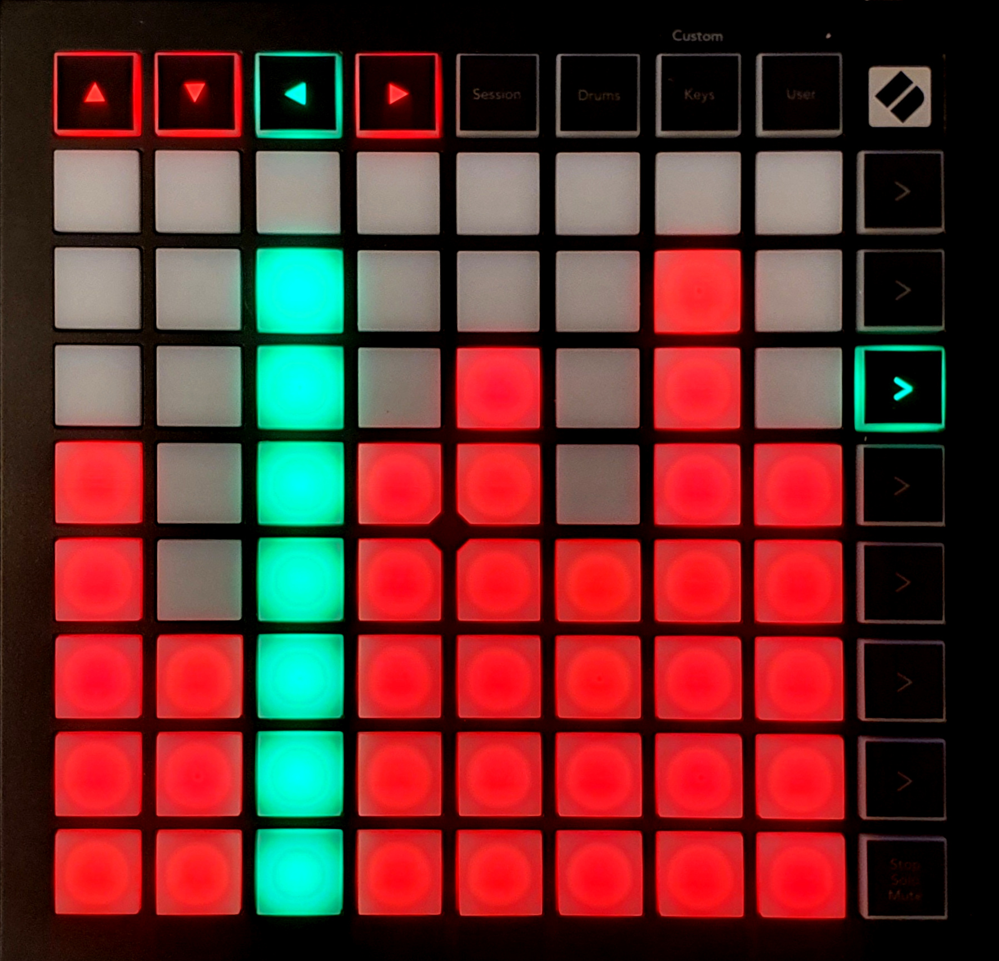

{align=right width=50%}

The playlist volume control screen gives control over the volume of the tracks that have been set up in the [Playlist Control](./playlist.md). 
You can enter the playlist volume control by pressing the third function key from the top.

The 8 control keys in the top represent the 8 playlists from the playlist control screen. The fading LED indicates which playlist you are currently controlling, and selecting a different control key will switch the control to the corresponding playlist.

The main keys are divided into 8 columns, where each column represents a track, which correspond to 8 tracks in the playlist. The amount of LEDs that are on represents the volume of the track. Pressing any of the keys sets the volume to that level. If a playlist and/or track is playing, the corresponding LEDs will turn green (by default). If there are more than 8 tracks in the playlist, pressing the playlist volume control function key will toggle between up to 4 pages, where each page controls 8 tracks.

You can change the colors of the LEDs in the [Playlist Configuration](./playlist.md#playlist-configuration).

Below the volume control function key, up to 4 function keys will start blinking or fading, this indicates how many pages are available (determined by the amount of function keys that are lit), and the blinking led indicates on which page you currently are. The volume control function key will also change color to correspond with the selected page.

<b>Note 1:</b> Pressing any of the blinking or fading function keys will take you out of the volume control screen, and into the screen that key is assigned to (for example, pressing the key below the volume control key will open the visual effects control screen). You have to toggle between the pages by pressing the volume control function key (third function key from the top).

<b>Note 2:</b> The page functionality is not shown in the image. 