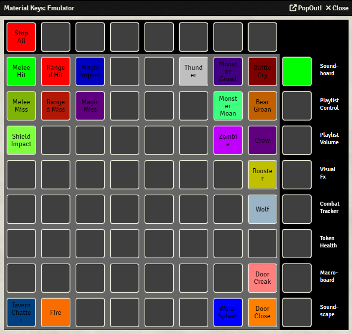
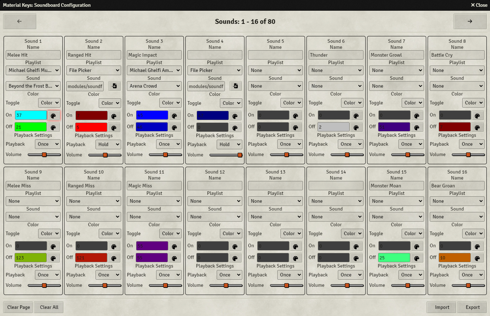

{align=right width=50%}
Using the Soundboard, you can easily play audio tracks. 
You could, for example, set up some keys to play battle effects, such as clashing swords, arrow hits, or explosions. Another thing you could do is to create an atmosphere, by setting some keys to play, for example, weather sounds.

You can enter the Soundboard by pressing the first Function key from the top. 
Once you've set up the soundboard, pressing a key will play the pre-set sound and change the LED to indicate the sound is playing. Pressing the key again will stop the sound. 
 
The red button on the top left (left-most Control key) will stop all currently playing sounds.

 

### Soundboard Configuration
{align=right width=50%}
The Soundboard is set-up in the Soundboard Configuration screen, which can be found in the module settings. 
The screen is divided into boxes, each labeled 'Sound #', where each represents a single sound and its settings. This screen will be refered to as a page.

By pressing the arrows at the top right and top left, you can go to the next or previous page. Sound 1 is the top left main key, Sound 2 is the one to the right of that, etc. 
You can set up a total of 256 sounds. Since there are only 64 keys on the Launchpad, you have to access the next 64 sounds by pressing the first Function key from the top.

For each sound there are multiple options:

* <b>Name:</b> (Optional) Set a name for the sound. This is only used in the [emulator](../emulator.md)
* <b>Playlist:</b> Sets the playlist from which you want to select a sound. If you select 'File Picker', a file picker will appear instead of the sound selection drop-down menu
* <b>Sound:</b> This is either a drop-down menu where you can select a sound from the selected playlist, or a file picker. 
    When using the file picker, it is possible to use wildcard names, this means that you can randomly play a sound from a selection. To do this, navigate to the folder that 
    contains the sounds, in the textbox append the folder name with the common part of the name of the sounds you want to play, followed by an asterisk.
    For example, if you have the sounds 'Thunder.wav', 'Thunder2.wav' and 'Thunder3.wav' in the folder 'Assets', you could fill in the following: 'Assets/Thunder*', which 
    will play one of the three sounds randomly when you press the key on the Launchpad
* <b>Toggle:</b> This determines what should be done once a sound is activated. You can either change the LED color ('Color'), cause the LED to blink on and off ('Blink'), or cause the LED to fade on and off ('Fade'). Once the sound has finished playing, the LED will automatically switch to the off mode
* <b>On:</b> This sets the color when the chosen sound is playing, and 'Toggle' is set to 'Color'. See [here](../colorPicker.md) for information on what the color number represents
* <b>Off:</b> This sets the color when the chosen sound is not playing. See [here](../colorPicker.md) for information on what the color number represents
* <b>Playback:</b> Sets the playback mode. The sound can either play once ('Once'), be played on repeat ('Repeat'), or only be played as long as the key is pressed ('Hold')
* <b>Volume:</b> Sets the playback volume. This volume is relative to the 'Interface' volume set in the 'Audio Playlists' tab in the Foundry sidebar

At the bottom you have the following buttons:

* <b>Clear Page</b> - Clears all the sounds on the current page. That this is irreversible.
* <b>Clear All</b> - Clears all the sounds. This is irreversible.
* <b>Import</b> - Import the soundboard from a file. This will override your current soundboard, and is irreversible.
* <b>Export</b> - Export your soundboard to a file.

When importing and exporting, you only import/export the metadata, not the actual audio files. This means that you need to have the same audio files in the same relative location in both the source and target Foundry client,
or you might run into issues.