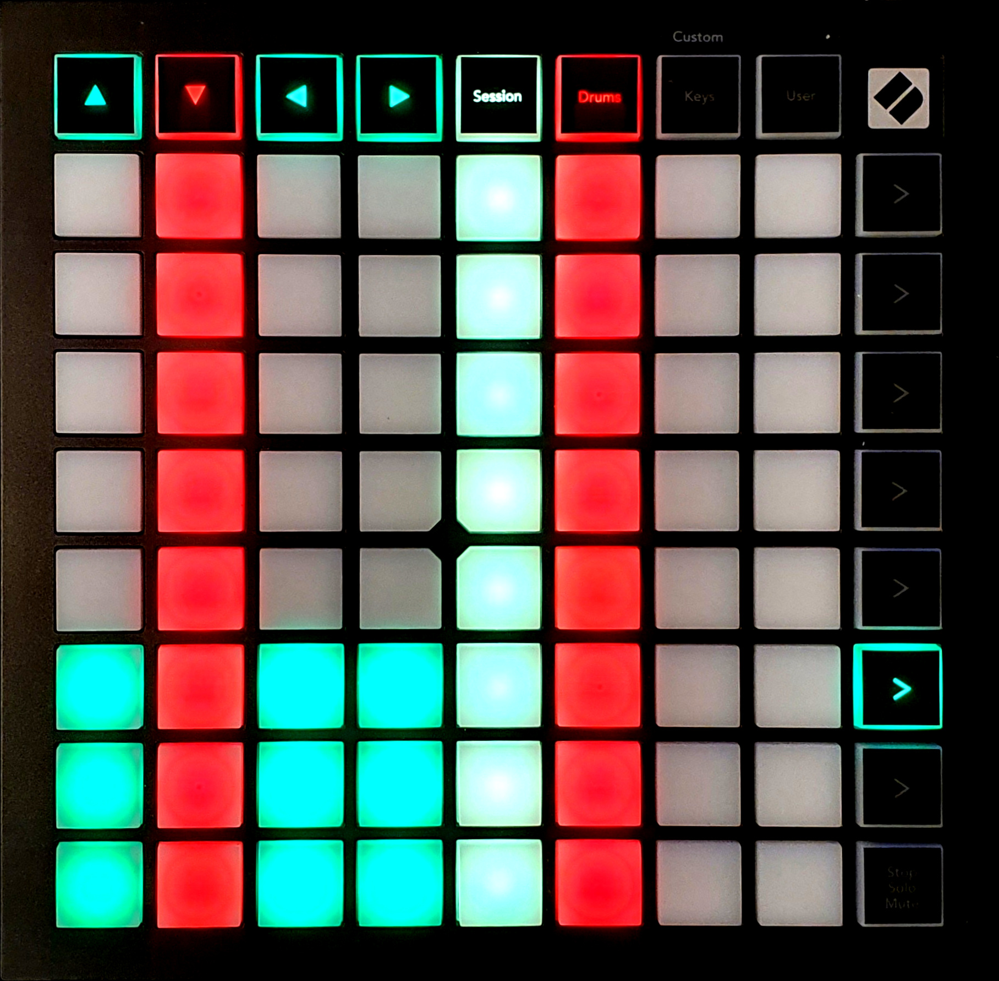

{align=right width=50%}
The token health screen gives a rough indication of the relative health of each token in the combat tracker. 
You can enter the token health screen by pressing the 6th function button from the top.

Each column, including the control keys, correspond with a token in the combat tracker. They are horizontally ordered by initiative, and colored to indicate hostility, just like the combat tracker. The amount of LEDs that are on, represent the relative health of the token, so an empty bar means the token has 0 health, while a full bar means the token has full health. A blinking column indicates whose turn it is. 
If there are more than 8 tokens in the initiative tracker, you can press the same function key again to go to the next 8 tokens, which changes the color of the function key to indicate this. Above the health tracker function key, up to 4 function keys will start blinking or fading, this indicates how many pages are available (determined by the amount of function keys that are lit), and the blinking led indicates on which page you currently are. A total of 32 tokens can be displayed.  
<b>Note 1:</b> Pressing any of the blinking or fading function keys will take you out of the health tracker screen, and into the screen that key is assigned to (for example, pressing the key above the health tracker function key will open the combat tracker screen). You have to toggle between the pages by pressing the health tracker function key (6th function key from the top). 
<b>Note 2:</b> This page functionality is not shown in the image below. 
<b>Note 3:</b> The health tracker might not work in your system. I have confirmed compatibility with DnD5e and pathfinder 2e. If your system isn't compatible, please let me know.