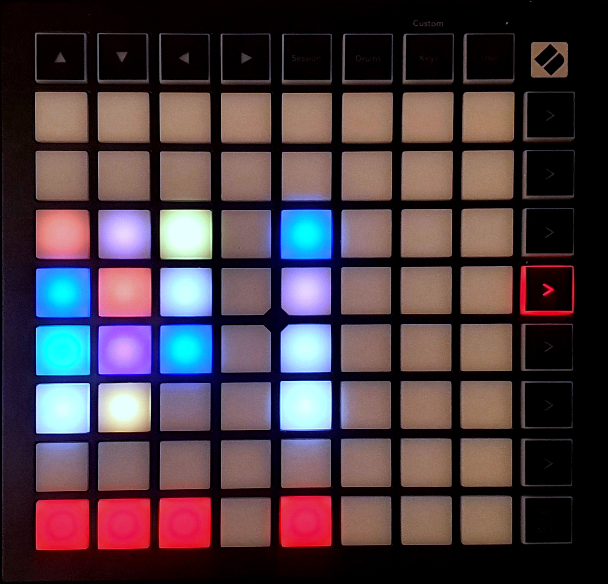

The visual effects control screen gives you control over certain visual effects. For most of these effects, the [FXMaster](https://foundryvtt.com/packages/fxmaster/) module is required. The visual effects control has 2 tabs. 
You can enter the visual effects control by pressing the fourth function key from the top. Furthermore, you can switch between the two tabs by pressing that key again, changing the color from green (tab 1) to red (tab 2). 

### Tab 1
{align=right width=50%}
There are 3 sections on this tab, separated by empty keys. 

* <b>Darkness:</b> On the left, there is a column of greyscale keys. These keys change the darkness level of the current scene, with the brightness of the keys corresponding to the darkness level.
* <b>Color overlay:</b> (FXMaster required) The second section, containing a column of colored keys, creates an overlay of that color. So, pressing the green key gives the scene a green overlay.
* <b>Extended color overlay:</b> (FXMaster required) The third section, containing 3 columns of red, green and blue keys, give further control over these colored overlays. Pressing the main keys in this section set the amount of red, green or blue in the overlay, by pressing the correspondingly colored keys. The 3 control (topmost) keys display this color, and pressing one of those keys clears the overlay.
 

### Tab 2
{align=right width=50%}
Tab 2 contains 2 sections, both requiring FXMaster: 

* <b>Weather effects:</b> The keys on the left control the FXMaster weather effects. The keys are colored in a way to approximate the weather effect, for example blue for rain, or grey for fog. You can switch on as many of the effects as you like, where fading keys indicate that that effects is on. Pressing one of the red keys in the bottom disables all weather effects.
     Available effects:
    * Leftmost column (top to bottom): Autumn Leaves, Rain, Snow, Snowstorm, Bubbles
    * Middle column (top to bottom): Clouds, Embers, Rain without splash, Stars
    * Right column (top to bottom): Crows, Bats, Fog, Topdown Rain
* <b>Filters:</b> To the right of the weather effects, there are 4 buttons. They control the FXMaster filters. From the top to the bottom: Underwater Filter, Predator Filter, Old Film Filter and Bloom Filter. Filters that are on are indicated by a fading key. The red key at the bottom disables all filters.