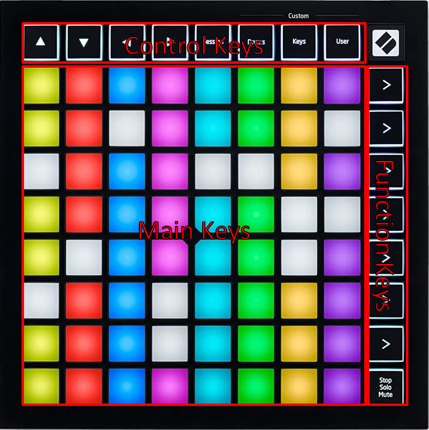

To get started using Material Keys, please follow these steps:

1. Install and enable the [Foundry Module](https://foundryvtt.com/packages/MaterialKeys)
2. Install [Material Companion](https://materialfoundry.github.io/MaterialCompanion/)
3. [Configure Material Companion](./materialCompanion.md)
4. [Configure the module settings](./moduleSettings.md)

### Usage

3 different key types can be found on the Launchpad:
{align=right width=35%}

* <b>Function keys: </b>The 8 vertical keys on the right, pressing these keys changes function of the Launchpad, see below for more info on the functions
* <b>Control keys: </b>The 8 horizontal keys on the top, the function of which will change depending on the selected Launchpad function
* <b>Main keys: </b>The other 64 keys that form the majority of keys

### Functions

By pressing one of the function keys (right-most column), you can change the function of the Launchpad. From the top to the bottom, these are:

* [Soundboard](./functions/soundboard.md): Play one-off sounds or sound effects
* [Playlist Control](./functions/playlist.md): Play tracks from Foundry playlists
* [Playlist Volume Control](./functions/playlistVolume.md): Control the volume of Foundry playlists
* [Visual Fx](./functions/visualFx.md): Control certain visual effects
* [Combat Tracker](./functions/combatTracker.md): Display and control the combat tracker
* [Token Health](./functions/tokenHealth.md): Display the token health of in-combat tokens
* [Macroboard](./functions/macroboard.md): Execute macros
* [Soundscape](./functions/soundscape.md): Control the [Soundscape](https://foundryvtt.com/packages/soundscape) module

When one of the function keys is pressed, that function key lights up in a static color. Some functions can have multiple pages, which are represented by function keys below the selected function that are lighting up in a fading pattern, where the selected page is blinking. 
To switch between the different pages, press the original function key. So if there are more than 64 configured soundboard sounds, 2 page indicators appear on the 'Playlist Control' and 'Playlist Volume Control' buttons. By pressing the 'Soundboard' function key you can switch between the first and second page. Pressing the 'Playlist Control' or 'Playlist Volume Control' keys will open the corresponding functions.