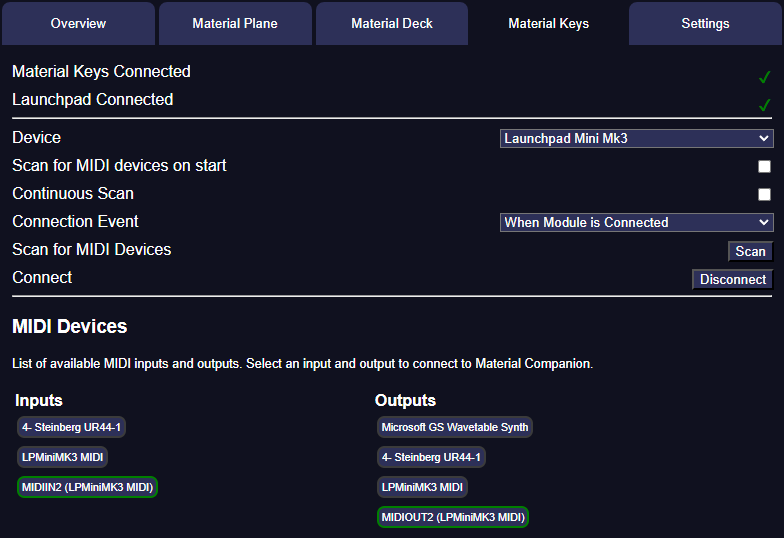

{align=right width=50%}
To get started with Material Keys, you will need to install [Material Companion](https://materialfoundry.github.io/MaterialCompanion/).

Material Companion is a companion app for multiple Material Foundry modules. It handles all MIDI communication between the Launchpad and Foundry, which is required because Foundry cannot natively connect to MIDI devices.

You can find the installation instructions [here](https://materialfoundry.github.io/MaterialCompanion/installation/).

## Connecting Material Companion to Foundry
To correctly use Material Companion, there are 3 important things to consider:

1. Material Companion must be running on the same computer that you have your Launchpad connected to
2. Foundry must be accessed from that same computer, so you must either run the Foundry application on that computer, or using a browser on that computer
3. The Material Companion address must be set correctly in the [module settings](./moduleSettings.md)

### Material Companion Address
The Material Companion address is the IP adress and port of Material Companion. Because it is running on your computer, this should be `localhost:[port]`. The port can be configured, by default it is set to 3001, in which case the address would be `localhost:3001`. You can confirm this in the [overview](https://materialfoundry.github.io/MaterialCompanion/overview/) tab of Material Companion.

The overview tab also gives an 'Alternative Material Companion Address'. If you are not familiar with the reason why you might want this you should ignore it and always use `localhost`, which should work for 99% of people. 
If you're having connection issues, this is probably due to something else, using the alternative address will not fix this for you.

## Material Keys Tab
In the 'Material Keys' tab you can find the relevant settings for Material Keys. This tab is split into 3 sections:

### Connection Status
At the top you can see if Material Companion has connected to a MIDI device and the Foundry module.

### Settings
You can find the following settings:

* Device: Sets the device to use, see [here](./supportedDevices.md) for the supported devices
* Scan for MIDI Devices on Start: If ticked, Material Companion will scan for MIDI devices on start
* Continuous Scan: If ticked, Material Companion will continuously scan for changes in MIDI devices
* Connection Event: This sets when Material Companion will attempt to connect to the selected device, with the following options:
    * When Module is Connected: This will let Material Companion try to connect to the device as soon as Material Companion is connected to the Material Keys module
    * When Material Companion Starts: This will let Material Companion try to connect to the device as soon as Material Companion starts
    * Manually: This will only let Material Companion try to connect when you press the 'Connect' button
* Scan for MIDI Devices: Manually scan for MIDI devices
* Connect: Connect to the selected MIDI device

### MIDI Devices
Any detected MIDI devices are shown here. You can click on any of them to select them, which will turn them green. You have to select one input and one output for Material Keys to function.

When Material Keys tries to connect to a device, it will connect to the one selected here.