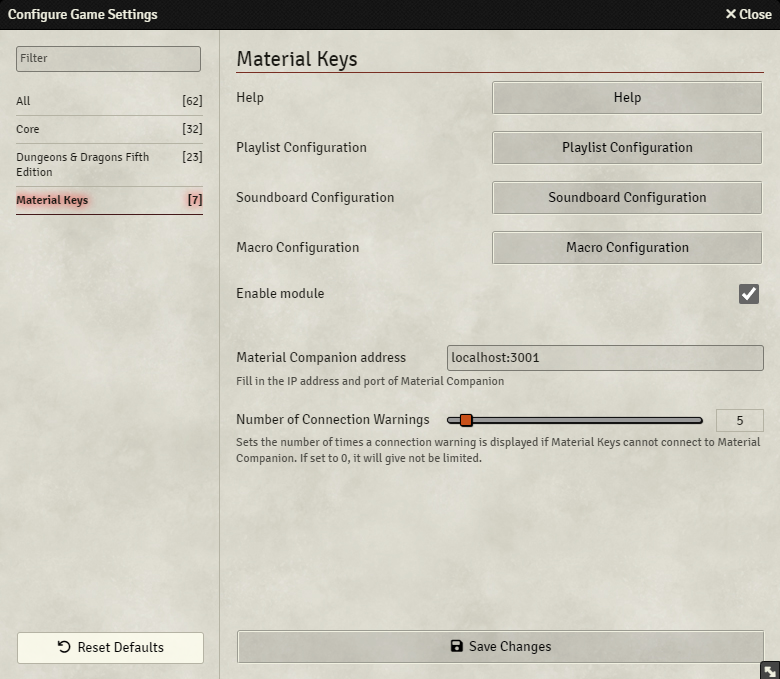

 {align=right width=40%}
The module settings allow for some configuration of the module.

At the top you can find 4 buttons:

* Help: Opens a browser window to this documentation
* Playlist Configuration: Opens the [playlist configuration screen](functions/playlist.md#playlist-configuration)
* Soundboard Configuration: Enter the [soundboard configuration screen](functions/soundboard.md#soundboard-configuration)
* Macro Configuration: Enter the [macro configuration screen](functions/macroboard.md#macro-configuration)

Below those buttons you will find the following settings:

* Enable Module: Enables the module for this client
* Material Companion Address: Fill in the address of Material Companion, see [here](./materialCompanion.md) for more info
* Number of Connection Warnings: Sets the number of times you will get a warning when Material Keys cannot connect to Material Companion. Will be unlimited if set to 0